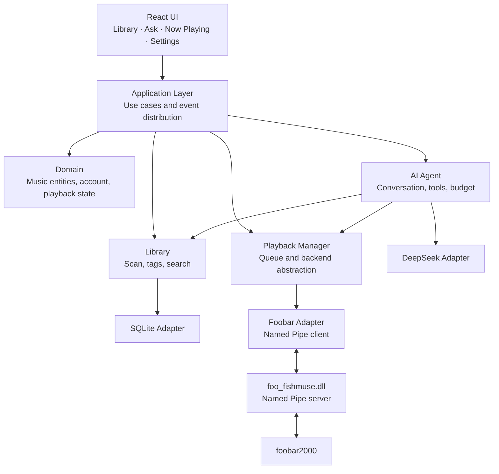
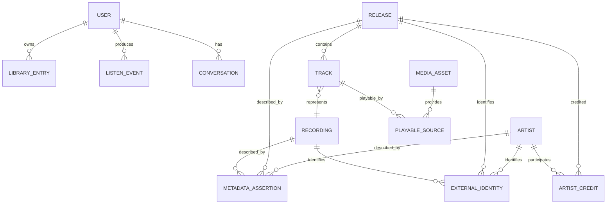
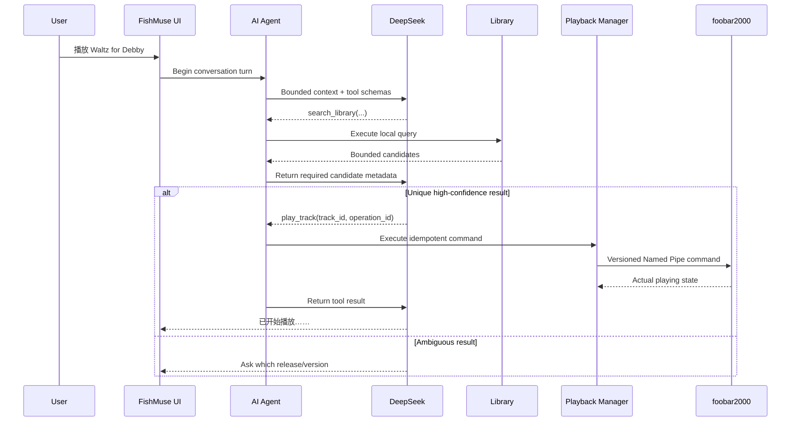

# FishMuse V0.1 “Muse Loop” Design

**Status:** Conversational design approved; written-spec review pending  
**Date:** 2026-09-27  
**Product direction:** Windows-first, local-first, personal-use-first  
**First release slice:** Local library → DeepSeek conversation → foobar2000 playback → state/history feedback

**简体中文版：** [2026-09-27-fishmuse-v0.1-muse-loop-design.zh-CN.md](2026-09-27-fishmuse-v0.1-muse-loop-design.zh-CN.md)

## 1. Purpose

FishMuse is an AI-native personal music system. It will eventually unify local music and streaming providers into a canonical, explorable music graph, learn the user's musical preferences, and provide a single conversational and graphical interface for discovery and playback.

V0.1 is intentionally narrower. It must prove the smallest end-to-end product loop that is recognizably FishMuse:

1. Import a real local music library into FishMuse's own database.
2. Ask DeepSeek questions that are answered using real local-library tools.
3. Select a specific local track through conversation.
4. Play it through foobar2000 without making foobar2000 the owner of FishMuse's data model.
5. Synchronize the actual playback state back into FishMuse.
6. Persist the conversation, tool execution, and listening events locally.

The canonical acceptance example is:

> User: “我的音乐库里有哪些 Bill Evans 的专辑？”  
> FishMuse queries the local database and answers from actual results.  
> User: “播放 Waltz for Debby。”  
> FishMuse resolves ambiguity when necessary, invokes a playback tool, starts foobar2000 through the bridge, and displays the resulting playback state.

## 2. Product Principles

- **Personal-first:** the first user is the owner of the Windows machine and local library.
- **Local-first:** the library, paths, conversations, listening history, settings, and credentials remain local unless a later sync feature explicitly says otherwise.
- **AI-native:** AI is allowed to query and operate the music system through explicit tools; it is not a decorative chat panel.
- **Provider-agnostic:** canonical music entities do not use a streaming provider's object as their identity.
- **Playback-backend-agnostic:** foobar2000 is the first mature backend, not a permanent dependency of the domain model.
- **Provenance-preserving:** metadata retains where it came from, when it was observed, and how confident FishMuse is in it.
- **Graceful degradation:** loss of DeepSeek or foobar2000 must not make the local library unusable.
- **No premature infrastructure:** V0.1 has no PostgreSQL, Redis, cloud service, Python worker, streaming provider, or native audio engine.

## 3. V0.1 Scope

### 3.1 Included

- A Windows desktop application using a React UI and Rust application core.
- A local user created on first launch.
- Selection and scanning of one or more local music directories.
- FishMuse-owned SQLite storage and FTS5 search projection.
- Browsing by artist, release, and track.
- A streaming AI chat backed by DeepSeek.
- Whitelisted tools for library lookup, playback control, and recent-listen lookup.
- A versioned, bidirectional foobar2000 bridge over a Windows Named Pipe.
- Persistent conversations, tool runs, playback state, and listening events.
- Local diagnostics, cost accounting, and explicit error states.
- A reproducible automated test suite plus explicitly invoked live DeepSeek and foobar2000 tests.

### 3.2 Explicitly excluded

- Apple Music and NetEase integrations.
- MusicBrainz enrichment and mature cross-provider entity resolution.
- CUE parsing and logical-track import.
- Audio analysis, waveform generation, acoustic embeddings, and vector search.
- Taste-model recommendations and semantic similarity search.
- Cloud accounts and synchronization.
- A FishMuse-native audio playback engine.
- Linux support, installers, auto-update, code signing, telemetry, and crash upload.
- Editing tags, deleting files, moving files, or writing into the user's music directories.

### 3.3 CUE compatibility constraint

V0.1 recognizes `.cue` files and reports them as unsupported without creating incorrect tracks. The data model and playback contract must nevertheless permit one physical media asset to expose multiple logical tracks through a `subsong_index` or bounded time segment. Full CUE support is required for the complete Windows product, beginning in the Music Graph milestone.

## 4. Chosen Architecture

FishMuse V0.1 is a modular local monolith with one unavoidable external component: the foobar2000 plugin.



### 4.1 Boundary rules

- The React UI calls application use cases and subscribes to application events. It never opens SQLite, invokes DeepSeek, or connects to the Named Pipe directly.
- Domain code contains stable business types and ports. It does not depend on the desktop framework, SQL, HTTP, Windows APIs, or foobar2000 SDK.
- Library code owns scanning, tag normalization, conservative canonical projection, and queries.
- The AI Agent can reach Library and Playback only through a fixed tool registry.
- Playback Manager owns normalized state and the desired queue. Backends translate this contract into an external player's capabilities.
- `foo_fishmuse.dll` contains playback/control integration and protocol translation only. It contains no Music Graph or AI logic.
- Infrastructure adapters implement domain/application ports and are assembled by the desktop shell.

### 4.2 Initial repository shape

```text
Fishmuse/
├── apps/
│   └── desktop/                 # Tauri desktop shell and React UI
├── crates/
│   ├── fishmuse-domain/         # Stable business types and ports
│   ├── fishmuse-library/        # Scan, tags, canonical projection, queries
│   ├── fishmuse-storage/        # SQLite repositories and migrations
│   ├── fishmuse-ai/             # Agent loop, DeepSeek, tools, budget
│   └── fishmuse-playback/       # Queue, state machine, FoobarBackend
├── native/
│   └── foo-fishmuse/            # foobar2000 C++ component
├── protocol/
│   └── foobar-v1/               # IPC schema and cross-language test vectors
├── tests/
│   └── fixtures/                # Legal, minimal audio and event fixtures
└── docs/
```

Directories for cloud services, Python analysis, streaming providers, shared UI packages, or infrastructure deployment are added only when an approved milestone needs them.

## 5. Canonical Data Model

FishMuse distinguishes a musical recording, its placement on a release, and the source from which it can be played.



### 5.1 Entity meanings

- `User`: the ownership root. V0.1 creates exactly one local user but does not assume that all rows are globally ownerless.
- `Artist`: a person or group credited in a musical role.
- `Release`: a specific published edition, such as an original issue, remaster, or deluxe edition.
- `Recording`: a distinct recorded performance or mix and the primary future cross-provider merge target.
- `Track`: a numbered/ordered slot on a Release that references a Recording.
- `MediaAsset`: a physical or provider media resource. V0.1 assets are local files.
- `PlayableSource`: a backend-specific way to play a Track. It contains a backend, locator, optional `subsong_index`, and optional `start_ms`/`end_ms`.
- `LibraryEntry`: a user's ownership or saved relationship to an entity.
- `ExternalIdentity`: an identifier issued by MusicBrainz, Apple Music, NetEase, or another provider.
- `MetadataAssertion`: a field/value assertion with source, confidence, and observation time.
- `ListenEvent`: play, pause, seek, skip, completion, and related behavioral events.
- `Conversation`, `Message`, and `ToolRun`: locally persisted AI interaction and executed operations.

### 5.2 Identity and lifecycle rules

- Every entity has an internal UUID. A path and a provider ID are never primary keys.
- Missing local files become unavailable/tombstoned; entities and listening history are not immediately deleted.
- Artist and release credits are explicit many-to-many records with roles and ordering.
- Local tags are saved as assertions, then projected into the currently displayed canonical fields.
- V0.1 performs only conservative matching. Low-confidence candidates remain separate.
- `Work` and `Performance` are added with the MusicBrainz/classical-music milestone, not as unused V0.1 tables.
- FTS5 is a rebuildable search projection, not a source of truth.
- Database migrations are ordered, versioned, transactional, and backed up before a destructive or incompatible migration.

## 6. Library Import

### 6.1 Supported V0.1 input

The first scanner recognizes individual files with these extensions: `.flac`, `.mp3`, `.m4a`, `.aac`, `.ogg`, `.opus`, `.wav`, `.aif`, and `.aiff`. Playback still depends on the active backend's declared capabilities.

### 6.2 Scan flow

```text
Select roots
→ enumerate without following traversal cycles
→ classify supported/unsupported files
→ parse embedded metadata
→ create or update MediaAsset
→ conservatively project Artist / Release / Recording / Track
→ save MetadataAssertion rows
→ update FTS5 projection
→ emit progress and diagnostics
```

The scanner is cancellable and restartable. It writes in bounded transactions. A bad file records a structured diagnostic and does not fail the whole scan. Scanning runs off the UI thread and must not prevent browsing, AI conversation, or playback.

Incremental scanning distinguishes new, modified, moved, missing, and unchanged files without using a path as musical identity. The detailed file-identity algorithm is an implementation-plan decision, but it must be cross-platform-capable and collision-aware rather than dependent on a Windows-only file identifier.

Path handling uses native operating-system strings internally and does not assume that every path is valid UTF-8. Junction and symbolic-link traversal must not create loops or escape user-selected roots unexpectedly.

## 7. AI Provider and Agent

### 7.1 Provider policy

- All real cloud-model development, integration testing, and V0.x acceptance use DeepSeek.
- The production adapter uses the DeepSeek Responses API format and the `deepseek-flash` model.
- GPT/OpenAI requires no key, payment setup, test, configuration screen, or runtime dependency in V0.x.
- Internal interfaces remain provider-neutral so the production-provider decision can be revisited before V1.0.
- Unit and ordinary CI tests use `FakeAIProvider` or recorded DeepSeek event fixtures.

### 7.2 Credentials and privacy

- The DeepSeek key is stored in Windows Credential Manager.
- The key, Authorization headers, and raw secrets never enter SQLite or logs.
- DeepSeek receives the user's question, agent instructions, tool schemas, recent conversation context, a local summary, and only the necessary results of local queries.
- Audio data, the complete database, local file paths, and directory roots are not sent to DeepSeek.
- Full conversation history is stored locally. Because the DeepSeek Responses API is treated as stateless, FishMuse constructs each bounded request context locally.

### 7.3 V0.1 tools

- `search_library`
- `get_library_item`
- `get_recent_listens`
- `get_playback_state`
- `play_track`
- `pause_playback`
- `resume_playback`
- `seek_playback`
- `skip_next`

Tool arguments are validated by local schemas and business rules. A turn may execute at most six tool calls. Search results return at most 20 items by default. Ambiguous playback candidates require a follow-up question rather than arbitrary selection. Side-effecting calls carry an `operation_id` so provider retries cannot repeat the action.

Metadata, tags, lyrics, external descriptions, and tool results are untrusted data. The Agent must not treat text inside them as instructions.

### 7.4 Cost controls

- Each live request records input, cache-hit, and output tokens plus an estimated RMB cost.
- At ¥10 of DeepSeek usage in a calendar month, FishMuse warns the developer/user.
- At ¥20, automatic live/network tests stop. A manually initiated call may proceed only after explicit confirmation.
- Tool results are bounded and long conversation history is summarized to control context growth.
- Cost calculations use the current configured price table and label estimates as estimates; provider billing remains authoritative.

## 8. AI-to-Playback Flow



The UI shows streaming text and expandable tool-activity states. Links to local artists, releases, and tracks open the corresponding FishMuse page. The final playback response identifies the selected version and backend.

## 9. Playback and Foobar Protocol

### 9.1 Playback abstraction

Playback Manager owns the normalized queue and states. The initial backend is `FoobarBackend`; future native and streaming implementations must satisfy the same application contract without changing the domain model.

Required V0.1 operations are play, pause, resume, stop, seek, next, set volume, and get state. Required events are state changed, track changed, position, volume changed, and playback error.

### 9.2 Named Pipe topology

`foo_fishmuse.dll` hosts the Named Pipe server. FishMuse is the client. The pipe is duplex and restricted by ACL to the current Windows user. No localhost TCP port is opened.

Connection establishment is:

```text
Connect
→ protocol-version handshake
→ current-user authorization
→ capability negotiation
→ complete playback-state snapshot
```

Every envelope contains a protocol version, message ID, optional correlation ID, timestamp, message kind, and validated payload. Schema and golden test vectors live in `protocol/foobar-v1/` and are consumed by both Rust and C++ tests.

The plugin performs pipe I/O off foobar2000's audio/UI thread and marshals SDK calls onto the appropriate foobar execution context. State transitions are sent immediately. Position is synchronized at low frequency while the FishMuse UI interpolates locally.

After disconnection, FishMuse enters a visible `disconnected` state. On reconnect, foobar2000's state snapshot is authoritative. Duplicate and out-of-order events are discarded through IDs and sequence information.

There is no silent command-line-control fallback. If foobar2000 is not running, FishMuse attempts one configured launch. A missing plugin, incompatible version, timeout, or playback failure is returned as a typed backend error.

## 10. Desktop Experience

V0.1 has four navigation destinations and a persistent mini-player:

```text
┌──────────────┬────────────────────────────────────┐
│ Library      │                                    │
│ Ask FishMuse │            Current page            │
│ Now Playing  │                                    │
│ Settings     │                                    │
├──────────────┴────────────────────────────────────┤
│ Artwork │ Track / Artist │ ◀ ▶ ❚❚ │ Progress    │
└───────────────────────────────────────────────────┘
```

### 10.1 First run

1. Create the local user.
2. Select music roots.
3. Detect foobar2000 and `foo_fishmuse`.
4. Configure and verify the DeepSeek key.
5. Start scanning and show progress.
6. Enter the application as soon as the first useful batch is available.

Every step is recoverable and may be completed later. Missing AI configuration does not block Library. Missing playback integration does not block scanning or read-only AI questions.

### 10.2 Pages

- **Library:** artist/release/track views, global search, scan status, diagnostics, and metadata provenance.
- **Ask FishMuse:** streaming answers, expandable tool activity, clickable local results, ambiguity resolution, retry, and collapsed per-turn token/cost details.
- **Now Playing:** artwork, canonical and release information, selected source/backend, transport, seek, volume, connection state, and synchronization of changes made directly in foobar2000.
- **Settings:** library roots, DeepSeek credentials/budget, foobar detection/plugin status/test playback, database/backup/diagnostics, and privacy information.

Home, Explore, streaming-provider sign-in, sync, analysis, and recommendation settings do not appear until implemented.

## 11. Error Model and Recovery

Expected failures use a typed application error with:

```text
code
category
user_message
technical_context
retryable
suggested_action
```

Raw Rust, SQL, HTTP, DeepSeek, Windows, or foobar exceptions are not displayed directly.

### 11.1 DeepSeek

- Missing key directs the user to Settings.
- Authentication failure is not retried.
- Rate limit, timeout, and temporary service failures use exponential backoff with at most two automatic retries.
- Budget/credit exhaustion blocks automatic calls without affecting local features.
- Interrupted streams retain partial output and mark the message incomplete.
- Invalid tool arguments are returned for one model correction; repeated invalidity ends the turn.
- More than six tool calls ends the turn with a diagnostic.
- Offline mode leaves Library and playback operational.

### 11.2 Foobar

- A missing plugin produces setup guidance.
- Protocol mismatch rejects the connection and reports both versions.
- Command timeout triggers state reconciliation before any resend.
- Playback failure marks that source unavailable without invalidating the Recording.
- Queue intent is retained across a temporary backend disconnection.

### 11.3 Storage and scanner

- Permission, parser, and file errors are isolated per item.
- SQLite enables foreign keys and WAL and uses controlled transactions.
- Migration failure never continues into a half-upgraded application.
- Temporary media absence preserves canonical entities and history.
- FishMuse never writes to, moves, or deletes the user's audio files.

## 12. Security and Privacy

- Named Pipe access is limited to the current Windows user.
- Pipe messages have size limits and strict type/range/version validation.
- AI tools expose no arbitrary SQL, filesystem, shell, network, or plugin execution.
- V0.1 has no destructive AI tool, purchase action, account mutation, or tag editing.
- Playback commands do not require an extra confirmation because they are reversible and directly requested in the chat context.
- Diagnostic logs redact secrets, Authorization headers, and sensitive paths.
- Telemetry and crash upload are absent in V0.1. A future crash reporter is opt-in.
- Application data is local and exportable; cloud synchronization requires a separate approved design.

## 13. Verification Strategy

### 13.1 Automated layers

| Layer | Coverage | External dependency |
|---|---|---|
| Rust unit | Domain types, matching, state machine, agent loop, budgets | None |
| Storage integration | Migrations, transactions, incremental update, FTS5, recovery | Temporary SQLite |
| Scanner | Tags, bad files, move/delete, repeated scans, native paths | Repository fixtures |
| AI contract | Streaming events, tools, malformed arguments, retries, accounting | Fake/recorded DeepSeek |
| IPC contract | Rust/C++ parity, versioning, malformed/duplicate/out-of-order messages | Golden vectors |
| React | Page states, errors, stream rendering, playback state | Mock application backend |
| Live integration | DeepSeek and Named Pipe behavior | Explicit developer invocation |
| End to end | Import → ask → resolve → play → state/history | Full Windows environment |

Ordinary CI runs format, Rust/TypeScript lint, unit tests, SQLite integration tests, frontend tests, IPC conformance tests, and builds. It does not contact DeepSeek or start foobar2000.

All live cloud tests use DeepSeek. Repository fixtures contain no personal music, personal paths, or secrets.

### 13.2 Required adversarial cases

- Tags that contain prompt-like malicious instructions.
- Unknown tools and invalid tool arguments.
- A stream ending midway through tool arguments.
- Duplicate delivery of a side-effecting call.
- Older/newer foobar protocol versions.
- Oversized, truncated, duplicate, and out-of-order IPC messages.
- Application termination during a scan.
- A music root disappearing and later returning.
- A moved file retaining its canonical/history relationship.
- `.cue` recognition without incorrect track creation.
- Automatic live calls after the monthly hard test budget.

### 13.3 Local performance targets

- Search across 100,000 synthetic Tracks has warm-cache P95 below 200 ms on the development machine.
- Scanning does not block UI interaction or playback commands.
- A healthy local foobar command is acknowledged within 500 ms.
- An unchanged repeat scan does not reparse every file.
- Smooth UI progress does not depend on high-frequency IPC messages.
- Database and diagnostic logs have bounded growth policies.

Network-model latency is observed but is not part of a deterministic local performance gate.

## 14. V0.1 Release Acceptance

V0.1 is complete only when all of these pass:

1. A clean first run of the built application creates a local user and accepts music roots.
2. Common individual audio files import while damaged files remain isolated.
3. Artists, Releases, and Tracks can be browsed and searched.
4. A real DeepSeek conversation answers a local-library question from actual tool results.
5. Ambiguous playback requests ask for clarification.
6. A unique selection plays through `foo_fishmuse` and foobar2000.
7. FishMuse displays the actual track, state, and progress.
8. Direct pause/track changes in foobar2000 synchronize back.
9. Library, conversation, and listening history survive restart.
10. Network, provider-credit, and bridge failures do not break Library.
11. No audio, complete database, directory root, or local path is sent to DeepSeek.
12. A clean Windows development machine can follow written build/deployment steps and reproduce the loop without relying on an installer.

An application window opening is not sufficient evidence of completion.

## 15. Program Roadmap Beyond V0.1

Each later milestone receives its own spec, plan, tests, and acceptance gate.

| Version | Outcome | Gate |
|---|---|---|
| V0.2 Music Graph | MusicBrainz, provenance resolution, auditable entity matching, CUE | Merge decisions are explainable and reversible |
| V0.3 Unified Providers | Apple Music, NetEase adapter, capabilities, unified search | Provider failure cannot break Core |
| V0.4 Semantic Music | Local analysis, embeddings, vector/semantic retrieval | Evaluated queries such as “similar but stronger drums” |
| V0.5 Taste & Discovery | Behavioral/explicit taste model and explainable recommendation | Recommendations trace to signals and music features |
| V0.6 Account & Sync | Optional account, settings/history/taste sync and conflict rules | Local-only mode remains fully usable |
| V0.9 Windows RC | Installer, updater, backups, accessibility, signing, diagnostics | Clean install/upgrade/rollback passes |
| V1.0 Windows | Stable personal AI music system | Full regression, migration, privacy, and release gates pass |

### 15.1 Cloud boundary

Future sync may include account, settings, canonical identities, library references, listening history, taste profile, playlists, and AI memory. By default it does not include audio files, local paths, waveforms, raw analysis cache, provider credentials, or the DeepSeek key.

### 15.2 Playback evolution

V1.0 Windows may use foobar2000 as the mature local backend. A FishMuse-native backend and Linux desktop release belong after the Windows product is stable. Foobar integration remains a useful Windows advanced option rather than being removed.

### 15.3 Deferred product areas

Multi-room playback, advanced DSP, social features, mobile remote control, and device certification are not promised by the V1.0 roadmap and require separate evaluation.

## 16. Decisions Fixed by This Spec

- Product name: FishMuse.
- First user and deployment model: personal-use-first, local-first.
- First architecture: modular desktop monolith, not a local daemon and not a foobar-owned frontend.
- Windows first; Linux later.
- FishMuse owns its library and canonical model.
- foobar2000 is a replaceable playback backend connected by a dedicated component and Named Pipe.
- V0.1 includes a real AI conversation loop.
- DeepSeek is the only real V0.x cloud provider and `deepseek-flash` is the default model.
- OpenAI payment or availability is not a V0.x dependency.
- Real provider tests use DeepSeek; deterministic tests use fakes/fixtures.
- Monthly live-test budget warns at ¥10 and stops automatic live tests at ¥20.
- CUE is not implemented in V0.1 but is required in the complete Windows product.
- V0.1 does not introduce cloud infrastructure, streaming providers, Python analysis, or native audio playback.
