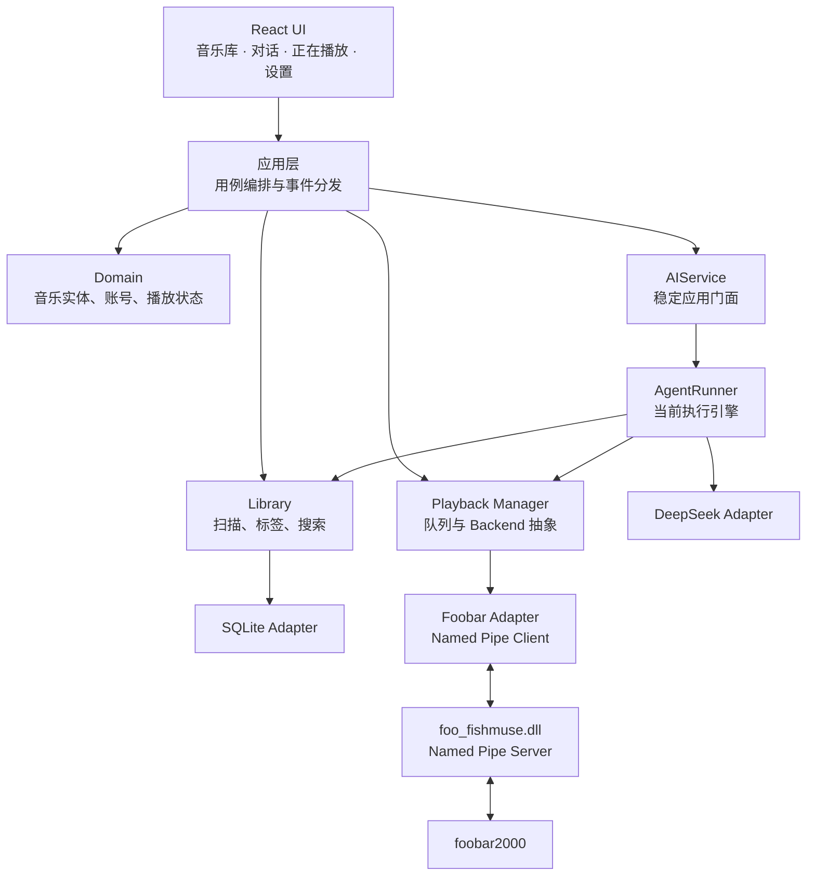
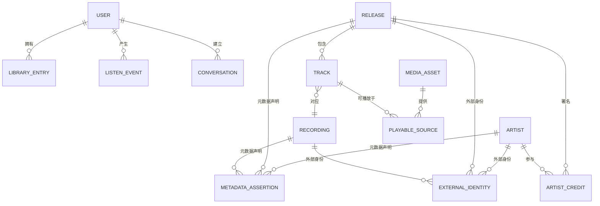
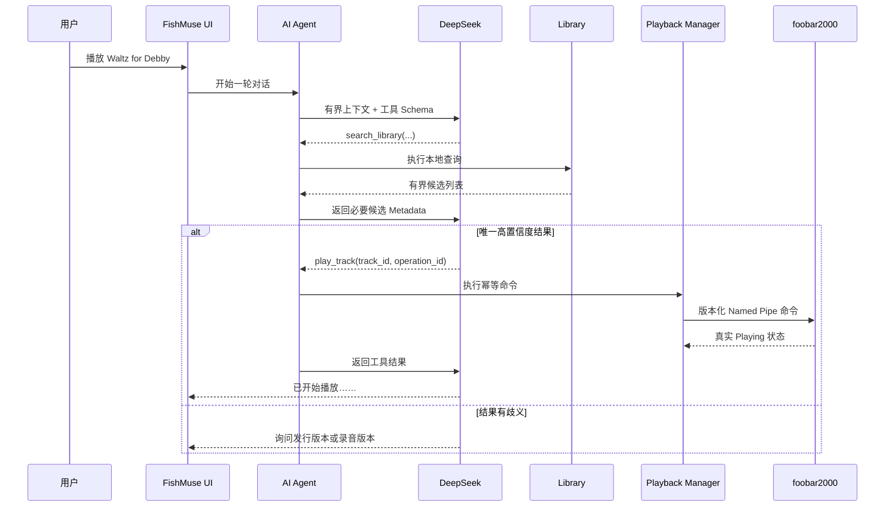

# FishMuse V0.1“灵感闭环”设计规格

**状态：** 已批准；2026-09-29 在 Task 12 前补充 Architecture Contract Freeze
**日期：** 2026-09-27  
**产品方向：** Windows 优先、本地优先、个人使用优先  
**首个发布切片：** 本地音乐库 → DeepSeek 对话 → foobar2000 播放 → 状态与历史反馈

**英文原稿：** [2026-09-27-fishmuse-v0.1-muse-loop-design.md](2026-09-27-fishmuse-v0.1-muse-loop-design.md)

## 1. 目标

FishMuse 是一个 AI-native 的个人音乐系统。它以 Canonical Music Graph 和 Personal Taste Model 为长期核心，由受控 AI 持续整理、理解和引导，并通过可插拔 Music Provider 与 Playback Backend 连接现实音乐生态。FishMuse 自身是唯一主前端；本地音乐和未来流媒体内容最终统一到一个规范化、可探索的音乐图谱中，通过同一图形界面与对话界面完成发现、检索与播放。

V0.1 有意控制范围。它必须证明最小但完整、并且已经具有 FishMuse 特征的产品闭环：

1. 将真实的本地音乐库导入 FishMuse 自己的数据库。
2. 使用 DeepSeek 回答问题，并通过真实的本地音乐库工具取得事实。
3. 在对话中选定一个具体的本地 Track。
4. 通过 foobar2000 播放，但不让 foobar2000 拥有 FishMuse 的数据模型。
5. 将真实播放状态同步回 FishMuse。
6. 在本地持久化对话、工具执行记录和收听事件。

标准验收示例为：

> 用户：“我的音乐库里有哪些 Bill Evans 的专辑？”  
> FishMuse 查询本地数据库，并依据真实结果回答。  
> 用户：“播放 Waltz for Debby。”  
> 如果存在歧义，FishMuse 先询问用户；目标明确后调用播放工具，通过 foobar2000 Bridge 开始播放，并展示真实播放状态。

## 2. 产品原则

- **个人优先：** 第一位用户就是 Windows 电脑与本地音乐库的所有者。
- **本地优先：** 音乐库、路径、对话、收听历史、设置和凭据默认保存在本地；后续同步功能必须明确声明其上传内容。
- **AI-native：** AI 通过明确、受控的工具查询并操作音乐系统，而不是播放器旁边的装饰性聊天框。
- **Provider 无关：** Canonical 音乐实体不能把任何流媒体平台的对象当作自身身份。
- **播放 Backend 无关：** foobar2000 是第一个成熟播放 Backend，不是 Domain 层的永久依赖。
- **保留来源：** Metadata 必须记录来源、观察时间和置信度。
- **优雅降级：** DeepSeek 或 foobar2000 不可用时，本地音乐库仍然可用。
- **不提前堆基础设施：** V0.1 不引入 PostgreSQL、Redis、云服务、Python Worker、流媒体 Provider 或原生音频引擎。

## 3. V0.1 范围

### 3.1 包含内容

- 使用 React UI 和 Rust 应用核心的 Windows 桌面应用。
- 首次启动时创建本地用户。
- 选择并扫描一个或多个本地音乐目录。
- FishMuse 自己维护的 SQLite 数据库和 FTS5 搜索投影。
- 按 Artist、Release 和 Track 浏览。
- 使用 DeepSeek 的流式 AI 对话。
- 用于音乐库查询、播放控制和近期收听查询的白名单工具。
- 通过 Windows Named Pipe 连接 foobar2000 的版本化双向 Bridge。
- 持久化对话、工具运行、播放状态和 ListenEvent。
- 本地诊断、API 成本统计和明确的错误状态。
- 可重复执行的自动化测试，以及需要显式启动的真实 DeepSeek 与 foobar2000 测试。

### 3.2 明确不包含

- Apple Music 和网易云接入。
- MusicBrainz 补全和成熟的跨 Provider 实体解析。
- CUE 解析与逻辑分轨导入。
- 音频分析、波形、声学 Embedding 和向量搜索。
- Taste Model 推荐和语义相似度搜索。
- 云账号与同步。
- FishMuse 原生音频播放引擎。
- Linux 支持、安装器、自动更新、代码签名、遥测和崩溃上传。
- 修改标签、删除文件、移动文件或向用户音乐目录写入内容。

### 3.3 CUE 兼容约束

V0.1 会识别 `.cue` 文件并报告“暂不支持”，但不能为其创建错误 Track。数据模型和播放协议必须允许一个物理媒体资源通过不同的 `subsong_index` 或时间区间对应多个逻辑 Track。完整 Windows 产品必须支持 CUE，该能力从 Music Graph 里程碑开始实现。

## 4. 已选架构

FishMuse V0.1 采用模块化本地单体，唯一不可避免的外部组件是 foobar2000 插件。



### 4.1 边界规则

- React UI 只能调用应用用例并订阅应用事件，不能直接打开 SQLite、调用 DeepSeek 或连接 Named Pipe。
- Domain 代码只包含稳定业务类型和 Port，不依赖桌面框架、SQL、HTTP、Windows API 或 foobar2000 SDK。
- Library 负责扫描、标签规范化、保守的 Canonical 投影和查询。
- 应用层和 Tauri `AppState` 只能依赖 provider-neutral `AIService`；当前 `AgentRunner` 是门面之后的执行引擎，不能成为长期 UI contract。
- AI Agent 只能通过固定工具注册表访问 Library 和 Playback。
- Playback Manager 维护规范化播放状态和期望队列；Backend 负责把统一协议转换成外部播放器能力。
- `foo_fishmuse.dll` 只负责播放控制、状态同步与协议转换，不包含 Music Graph 或 AI 逻辑。
- 基础设施 Adapter 实现 Domain/Application Port，并由桌面 Shell 组装。

### 4.3 Core、AI 与确定性能力边界

- FishMuse Core 在无 AI、无网络、无 AI credential 时仍能导入、浏览、搜索和管理 Library/Music Graph；在 Playback Backend 未连接时，所有非播放功能仍可用。
- 确定性算法能够可靠解决的工作由普通代码完成。生成式 AI 主要承担模糊语义、假设、解释、信息综合和个性化理解。
- V0.1 在 `AgentRunner` 之上冻结最小 `AIService`/application facade。长期演进为 AI Control Plane，包含 Context Engine、Orchestrator、Model Router、Policy Engine、Attention Manager、Budget Manager、Job Engine 和 Trace/Evaluation；这些长期组件不在 V0.1 实现。
- Curator、Listener、Guide、Agent 是逻辑角色或 capability profile，不等于当前需要多个 autonomous agents。

### 4.4 上下文、事件与写入治理

- 应用调用 AI 使用 provider-neutral `ContextEnvelope`。V0.1 只接受来自 FishMuse 自身 UI 的可选结构化语义上下文，为 Current View、Selected Entity、Selected Text、Now Playing 与 Contextual Ask 预留边界；不实现截图、OCR 或全局 Capture。
- FishMuse UI 的上下文策略始终是 structured semantic context first、screenshot/vision second。
- AI 对 UI 发出的应用事件使用版本化 envelope，至少包含 contract version、turn id、严格递增 sequence、event type 和 payload。DeepSeek wire event 与内部 `AgentEvent` 不直接成为长期 UI contract。
- AI 不能直接写 Canonical Graph。长期重要写操作遵循 Observe → Reason → Propose → Review → Commit → Learn，并进入 Proposal/Revision/Audit 系统；V0.1 不实现写工具或完整 Proposal System。
- Metadata、Identity、歌词、网页、Provider 内容和 tool result 永远是 data，不是 instructions。Prompt-injection 防线、tool allowlist、参数校验和本地脱敏不能被未来角色或 Provider 绕过。

### 4.5 Music Provider 与 Playback Backend

- `MusicProvider` 与 `PlaybackBackend` 是两个独立概念。长期 Provider contract 使用 provider instance、capability、provider mapping 与 opaque provider identity/locator；Provider 故障不得污染 Core。
- `PlaybackBackend` 始终可替换。V0.1 使用 `FoobarBackend`，但 FishMuse UI/Application 不把 foobar2000 当作产品本体；成熟的 `NativeBackend` 达到质量门槛后可以成为默认，FoobarBackend 保留为可选高级 Backend。
- 服务状态以 generic `PlaybackServiceState`/`AIServiceState` 表达；具体 backend/provider 仅作为实现详情和诊断信息。

### 4.2 初始仓库结构

```text
Fishmuse/
├── apps/
│   └── desktop/                 # Tauri 桌面 Shell 与 React UI
├── crates/
│   ├── fishmuse-domain/         # 稳定业务类型与 Port
│   ├── fishmuse-library/        # 扫描、标签、Canonical 投影、查询
│   ├── fishmuse-storage/        # SQLite Repository 与 Migration
│   ├── fishmuse-ai/             # Agent Loop、DeepSeek、工具、预算
│   └── fishmuse-playback/       # 队列、状态机、FoobarBackend
├── native/
│   └── foo-fishmuse/            # foobar2000 C++ Component
├── protocol/
│   └── foobar-v1/               # IPC Schema 与跨语言测试向量
├── tests/
│   └── fixtures/                # 合法、最小化的音频与事件 Fixture
└── docs/
```

云服务、Python 分析、流媒体 Provider、共享 UI Package 或部署基础设施只在已批准里程碑确实需要时添加。

## 5. Canonical 数据模型

FishMuse 必须区分“某次录音”“它在某个发行版本中的曲序位置”和“实际从哪里播放”。



### 5.1 实体含义

- `User`：数据归属根节点。V0.1 只创建一个本地用户，但数据表不能假设所有记录永久无所有者。
- `Artist`：以音乐角色获得署名的个人或团体。
- `Release`：一个具体发行版本，例如原版、Remaster 或 Deluxe。
- `Recording`：一次具体录音表演或混音，也是未来跨 Provider 合并的主要对象。
- `Track`：Release 中有序、有编号的曲目位置，引用一个 Recording。
- `MediaAsset`：物理媒体资源或 Provider 媒体资源；V0.1 仅为本地文件。
- `PlayableSource`：播放 Track 的 Backend 特定方式，包含 Backend、Locator、可选 `subsong_index` 和可选 `start_ms`/`end_ms`。
- `LibraryEntry`：用户拥有或保存某个实体的关系。
- `ExternalIdentity`：MusicBrainz、Apple Music、网易云或其他 Provider 分配的 ID。
- `MetadataAssertion`：带来源、置信度和观察时间的字段/值声明。
- `ListenEvent`：播放、暂停、Seek、跳过、完成等行为事件。
- `Conversation`、`Message`、`ToolRun`：本地持久化的 AI 交互和实际执行操作。

### 5.2 身份与生命周期规则

- 所有实体使用内部 UUID；文件路径和 Provider ID 永不作为主键。
- 本地文件缺失时先标记为不可用或 Tombstone，不立即删除实体和历史。
- Artist 与 Release 的 Credit 使用显式多对多记录，保存角色和顺序。
- 本地标签先保存为 MetadataAssertion，再投影为当前展示字段。
- V0.1 只做保守匹配；低置信度候选保持独立。
- `Work` 和 `Performance` 在 MusicBrainz/古典音乐里程碑加入，V0.1 不创建无用空表。
- FTS5 是可以重建的搜索投影，不是事实来源。
- 数据库 Migration 有序、版本化并采用事务；破坏性或不兼容迁移前必须备份。

## 6. 本地音乐导入

### 6.1 V0.1 支持的输入

首个 Scanner 识别这些单独音频文件扩展名：`.flac`、`.mp3`、`.m4a`、`.aac`、`.ogg`、`.opus`、`.wav`、`.aif` 和 `.aiff`。能否实际播放仍由当前 Backend 声明的能力决定。

### 6.2 扫描流程

```text
选择根目录
→ 在不形成遍历循环的前提下枚举
→ 区分支持与不支持的文件
→ 解析内嵌 Metadata
→ 创建或更新 MediaAsset
→ 保守投影 Artist / Release / Recording / Track
→ 保存 MetadataAssertion
→ 更新 FTS5 投影
→ 发出进度与诊断事件
```

Scanner 可以取消和重新启动，并使用有界批量事务。单个错误文件只产生结构化诊断，不能让整次扫描失败。扫描在 UI 线程之外运行，不能阻塞浏览、AI 对话或播放。

增量扫描必须区分新增、修改、移动、缺失和未变化文件，且不能用路径充当音乐身份。详细文件身份算法在实施计划中决定，但它必须具备跨平台能力并考虑碰撞，不能只依赖 Windows 文件 ID。

内部路径使用操作系统原生字符串表示，不能假定所有路径都是有效 UTF-8。Junction 和符号链接不能造成遍历循环，也不能意外逃出用户选择的根目录。

## 7. AI Provider 与 Agent

### 7.1 Provider 策略

- 所有真实云模型开发、集成测试和 V0.x 验收都使用 DeepSeek。
- 生产 Adapter 使用 DeepSeek Responses API 格式和 `deepseek-flash` 模型。
- V0.x 不要求 GPT/OpenAI Key、付款配置、测试、设置页面或运行时依赖。
- 内部接口保持 Provider-neutral，V1.0 前可以重新评估正式版 Provider。
- 单元测试和普通 CI 使用 `FakeAIProvider` 或录制的 DeepSeek 事件 Fixture。

### 7.2 凭据与隐私

- DeepSeek Key 存入 Windows Credential Manager。
- Key、Authorization Header 和原始 Secret 不得进入 SQLite 或日志。
- DeepSeek 只接收用户问题、Agent 指令、工具 Schema、最近对话、本地摘要和本地查询的必要结果。
- 音频数据、完整数据库、本地文件路径和目录根路径不得发送给 DeepSeek。
- 完整对话历史保存在本地。FishMuse 将 DeepSeek Responses API 视为无服务端状态，每次在本地构造有界请求上下文。

### 7.3 V0.1 工具

- `search_library`
- `get_library_item`
- `get_recent_listens`
- `get_playback_state`
- `play_track`
- `pause_playback`
- `resume_playback`
- `seek_playback`
- `skip_next`

工具参数必须通过本地 Schema 和业务规则校验。单轮最多执行 6 次工具调用；搜索默认最多返回 20 项。播放候选存在歧义时必须询问用户，不能任意选择。带副作用调用必须携带 `operation_id`，防止 Provider 重试造成重复操作。

Metadata、标签、歌词、外部描述和工具结果均属于不可信数据；Agent 不能把其中的文字当作指令。

### 7.4 成本控制

- 每次真实请求记录输入、缓存命中和输出 Token，并估算人民币成本。
- 一个自然月内 DeepSeek 用量达到 ¥10 时提示开发者/用户。
- 达到 ¥20 后停止自动真实联网测试；手动请求只有在明确确认后才能继续。
- 工具结果有数量上限；长对话通过摘要限制上下文增长。
- 成本估算使用当前配置的价格表并明确标记为估算，以 Provider 实际账单为准。

### 7.5 AI 应用边界

- V0.1 实际运行仍只使用 DeepSeek；长期 Model Router 的接口设计不得在当前版本引入额外云 Provider。
- `AIService` 接收应用级 turn request 和可选 `ContextEnvelope`，输出版本化应用事件。Desktop/Tauri 不构造 DeepSeek request，也不匹配 DeepSeek SSE 或内部 Agent event。
- V0.1 的上下文只来自 FishMuse 已知的安全 DTO；不读取屏幕、不监听其他应用，也不上传本地路径、API Key 或 `technical_context`。
- 所有结构化上下文和外部内容在进入模型时都明确标记为不可信数据，不能修改系统指令或工具权限。

## 8. AI 到播放的数据流



UI 流式显示回答，并显示可展开的工具活动状态。本地 Artist、Release 和 Track 结果可点击进入相应页面。UI 消费的是 `AIService` 的版本化应用事件，而不是 DeepSeek/Agent 内部事件。最终播放回答必须说明选中了哪个版本以及使用哪个 Backend。

## 9. Playback 与 Foobar 协议

### 9.1 Playback 抽象

Playback Manager 维护规范化队列和状态。第一个 Backend 是 `FoobarBackend`；未来原生和流媒体 Backend 必须实现同一个应用协议，不能改变 Domain 模型。

FishMuse 是主操作界面。日常浏览、提问和播放控制不能要求用户在 FishMuse 与 foobar2000 两套界面间来回切换。V0.1 不实现完整 foobar discovery/configuration/provisioning，但必须冻结这一产品边界。

V0.1 必需操作为 play、pause、resume、stop、seek、next、set volume 和 get state。必需事件为 state changed、track changed、position、volume changed 和 playback error。

### 9.2 Named Pipe 拓扑

`foo_fishmuse.dll` 承担 Named Pipe Server，FishMuse 是 Client。Pipe 为双工通信，并通过 ACL 限制为当前 Windows 用户访问；不开放 localhost TCP 端口。

连接流程为：

```text
连接
→ 协议版本握手
→ 当前用户授权
→ 能力协商
→ 完整播放状态快照
```

每个消息 Envelope 包含协议版本、消息 ID、可选关联 ID、时间戳、消息类型和经过验证的 Payload。Schema 和 Golden Test Vector 存放在 `protocol/foobar-v1/`，由 Rust 与 C++ 测试共同使用。

插件在 foobar2000 音频/UI 线程之外执行 Pipe I/O，并把 SDK 调用调度到正确的 foobar 执行上下文。状态变化立即发送；播放位置低频同步，FishMuse UI 在本地平滑插值。

断线后 FishMuse 进入可见的 `disconnected` 状态；重新连接后，以 foobar2000 返回的状态快照为准。重复和乱序事件通过 ID 与序列信息丢弃。

不提供静默命令行控制降级。foobar2000 未运行时，FishMuse 按已配置路径尝试启动一次；插件缺失、版本不兼容、超时或播放失败均返回类型化 Backend 错误。

## 10. 桌面体验

V0.1 提供四个导航入口和一个持久 Mini Player：

```text
┌──────────────┬────────────────────────────────────┐
│ Library      │                                    │
│ Ask FishMuse │              当前页面               │
│ Now Playing  │                                    │
│ Settings     │                                    │
├──────────────┴────────────────────────────────────┤
│ 封面 │ Track / Artist │ ◀ ▶ ❚❚ │ 播放进度       │
└───────────────────────────────────────────────────┘
```

### 10.1 首次运行

1. 创建本地用户。
2. 选择音乐根目录。
3. 检测 foobar2000 与 `foo_fishmuse`。
4. 配置并验证 DeepSeek Key。
5. 开始扫描并显示进度。
6. 第一批可用内容出现后即可进入应用，无需等待全部扫描完成。

每个步骤都可以恢复并延后完成。AI 未配置时不阻塞 Library；播放集成缺失时不阻塞扫描或只读 AI 问答。

### 10.2 页面

- **Library：** Artist/Release/Track 浏览、全局搜索、扫描状态、诊断和 Metadata 来源。
- **Ask FishMuse：** 流式回答、可展开工具活动、可点击本地结果、歧义消解、重试，以及默认折叠的单轮 Token/成本信息。
- **Now Playing：** 封面、Canonical 与发行信息、实际 Source/Backend、传输控制、Seek、音量、连接状态，以及从 foobar2000 直接操作后的反向同步。
- **Settings：** 音乐目录；`Playback → backend: foobar2000` 的检测/插件状态/测试播放；`AI → provider: DeepSeek` 的凭据/预算；数据库/备份/诊断和隐私说明。具体实现属于服务层级信息，不塑造成产品本体。

Home、Explore、流媒体登录、同步、分析和推荐设置只有在相应功能真正实现后才出现。

## 11. 错误模型与恢复

所有预期故障使用统一的类型化应用错误：

```text
code
category
user_message
technical_context
retryable
suggested_action
```

UI 不直接显示原始 Rust、SQL、HTTP、DeepSeek、Windows 或 foobar 异常。

### 11.1 DeepSeek

- 缺少 Key 时引导用户进入 Settings。
- 认证失败不重试。
- 限流、超时和临时服务故障使用指数退避，最多自动重试两次。
- 预算或余额不足时阻止自动调用，不影响本地功能。
- 流式响应中断时保留已接收内容，并将消息标记为未完成。
- 非法工具参数允许模型修正一次；再次非法则结束该轮。
- 超过 6 次工具调用时结束该轮并生成诊断。
- 离线状态下 Library 与 Playback 继续工作。

### 11.2 Foobar

- 插件缺失时显示设置说明。
- 协议版本不匹配时拒绝连接，并报告双方版本。
- 命令超时后先进行状态对账，再决定是否重发。
- 播放失败只标记对应 Source 不可用，不使整个 Recording 失效。
- Backend 临时断开时保留期望队列。

### 11.3 Storage 与 Scanner

- 权限、解析和文件错误按单项隔离。
- SQLite 开启 foreign keys 和 WAL，并使用受控事务。
- Migration 失败时不能继续进入半升级应用状态。
- 媒体暂时缺失时保留 Canonical 实体和历史。
- FishMuse 永远不修改、移动或删除用户音频文件。

## 12. 安全与隐私

- Named Pipe 仅允许当前 Windows 用户访问。
- Pipe 消息有大小限制，并严格校验类型、范围和协议版本。
- AI 工具不提供任意 SQL、文件系统、Shell、网络或插件执行能力。
- V0.1 没有破坏性 AI 工具、购买操作、账号修改或标签编辑。
- 播放命令可逆且来自当前对话的直接请求，因此无需额外确认。
- 诊断日志必须脱敏 Secret、Authorization Header 和敏感路径。
- V0.1 不包含遥测与崩溃上传；未来崩溃报告必须由用户主动启用。
- 应用数据保存在本地并可导出；云同步需要单独批准的设计。

## 13. 验证策略

### 13.1 自动化测试层级

| 层级 | 覆盖内容 | 外部依赖 |
|---|---|---|
| Rust 单元测试 | Domain 类型、匹配、状态机、Agent Loop、预算 | 无 |
| Storage 集成测试 | Migration、事务、增量更新、FTS5、恢复 | 临时 SQLite |
| Scanner 测试 | 标签、坏文件、移动/删除、重复扫描、原生路径 | 仓库 Fixture |
| AI 契约测试 | 流式事件、工具、非法参数、重试、成本统计 | Fake/录制 DeepSeek |
| IPC 契约测试 | Rust/C++ 一致性、版本、畸形/重复/乱序消息 | Golden Vector |
| React 测试 | 页面状态、错误、流式渲染、播放状态 | Mock 应用后端 |
| 真实集成测试 | DeepSeek 与 Named Pipe 行为 | 开发者显式启动 |
| 端到端测试 | 导入→询问→解析→播放→状态/历史 | 完整 Windows 环境 |

普通 CI 依次执行格式化、Rust/TypeScript Lint、单元测试、SQLite 集成测试、前端测试、IPC 一致性测试和构建；不访问 DeepSeek，也不启动 foobar2000。

所有真实云测试只使用 DeepSeek。仓库 Fixture 不得包含个人音乐、个人路径或 Secret。

### 13.2 必测对抗场景

- 标签中包含类似 Prompt 的恶意指令文本。
- 未知工具和非法工具参数。
- Tool Arguments 尚未完成时流式响应中断。
- 带副作用调用被重复投递。
- 更老或更新的 foobar 协议版本。
- 超大、截断、重复和乱序 IPC 消息。
- 扫描过程中应用退出。
- 音乐根目录消失后重新出现。
- 文件移动后仍保留 Canonical/History 关系。
- 识别 `.cue` 但不创建错误 Track。
- 达到月度硬预算后仍试图启动自动真实调用。

### 13.3 本地性能目标

- 在开发机上，对 100,000 个合成 Track 搜索时，热缓存 P95 小于 200 ms。
- 扫描不能阻塞 UI 交互或播放命令。
- 健康的本地 foobar 命令在 500 ms 内确认。
- 对未变化目录重复扫描时不能重新解析所有文件。
- UI 平滑进度不能依赖高频 IPC 消息。
- 数据库与诊断日志必须有有界增长策略。

网络模型延迟只做观测，不属于确定性的本地性能门槛。

## 14. V0.1 发布验收

V0.1 只有在以下条件全部通过后才算完成：

1. 构建产物首次干净运行时创建本地用户并允许选择音乐根目录。
2. 常见独立音频文件可以导入，损坏文件被单独隔离。
3. 可以浏览和搜索 Artist、Release、Track。
4. 真实 DeepSeek 对话能够依据真实工具结果回答本地音乐库问题。
5. 播放请求有歧义时会询问用户。
6. 目标唯一时通过 `foo_fishmuse` 和 foobar2000 播放。
7. FishMuse 展示真实曲目、状态和进度。
8. 用户直接在 foobar2000 中暂停或切歌时，FishMuse 能够同步。
9. 重启后 Library、Conversation 和 Listening History 仍然存在。
10. 网络、Provider 余额和 Bridge 故障不会破坏 Library。
11. 不向 DeepSeek 发送音频、完整数据库、目录根路径或本地路径。
12. 干净的 Windows 开发机能够按照书面构建/部署步骤复现完整闭环，且不依赖安装器。

此外必须验证架构边界：AI 未配置时 Core/Library 可用；Playback Backend 未连接时非播放功能可用；Fake AI/Fake Playback 能在不改变 UI contract 的情况下替换真实实现；AI context 不泄露 path、key 或 `technical_context`；React/Tauri presentation 不直接依赖 `DeepSeekClient` 或 `FoobarBackend`；FishMuse 保持主操作界面。

仅仅能够打开应用窗口不构成完成证据。

## 15. V0.1 之后的完整路线

每个后续里程碑都有独立的规格、计划、测试和验收门槛。

| 版本 | 成果 | 退出门槛 |
|---|---|---|
| V0.1.1 Architecture Hardening | Playback lifecycle/discovery/configuration/provisioning；AI Control Plane、Model Router、Policy Engine、Event Bus、Job Engine、AI Trace/Eval、Provider contracts | Core 与外部能力可独立替换、恢复和诊断 |
| V0.2 Music Graph & AI Curator | MusicBrainz、provenance、identity/version resolution、Proposal/Revision/Audit、AI metadata/library curation、CUE | 合并和修改决定可解释、可审阅、可撤销 |
| V0.3 Unified Providers | Apple Music、网易云等 Provider；capability/mapping/failure isolation、cross-provider identity | Provider 故障不能破坏 Core |
| V0.4 Semantic Music & Contextual AI | 音频/文本 Embedding、语义检索、structured Contextual Ask、selection/text/view capture，必要时 screenshot/vision | 语义查询与上下文问答通过评测且不越过隐私边界 |
| V0.5 Taste & Active AI | Preference Hypothesis Store、temporal/contextual taste、Listener/Guide、Music Knowledge Model、information-gain proactive questions、Attention Manager、AI Inbox 与可调交互策略 | 主动交互可解释、可调节并受注意力策略约束 |
| V0.6 Account & Sync | 可选账号、设置/历史/Taste 同步和冲突规则 | Local-only 始终完整可用 |
| V0.9 Windows RC | 安装器、更新、备份、无障碍、签名、诊断 | 干净安装/升级/回滚通过 |
| V1.0 Windows | 稳定个人 AI 音乐系统 | 完整回归、迁移、隐私与发布门槛通过 |

### 15.1 云端边界

未来同步可以包含 Account、Settings、Canonical Identity、Library Reference、Listening History、Taste Profile、Playlist 和 AI Memory。默认不同步 Audio File、Local Path、Waveform、Raw Analysis Cache、Provider Credential 或 DeepSeek Key。

### 15.2 Playback 演进

Native Playback 在成熟度、兼容性和恢复能力门槛达到后成为默认 Backend；不为追赶版本号提前切换。FoobarBackend 始终保留为有价值的 Windows 高级选项。Linux 桌面版在 Windows 产品稳定后实现。

### 15.3 延后评估的产品方向

多房间播放、高级 DSP、社交功能、手机遥控和设备认证不属于 V1.0 承诺范围，需要单独评估。

## 16. 本规格锁定的决定

- 产品名称：FishMuse。
- 首个用户和部署模型：个人使用优先、本地优先。
- 首个架构：模块化桌面单体，不是本地 Daemon，也不是由 foobar 拥有数据的前端。
- Windows 优先，Linux 后续。
- FishMuse 拥有自己的 Library 与 Canonical Model。
- foobar2000 是可替换的播放 Backend，通过专用 Component 与 Named Pipe 连接。
- FishMuse 是唯一主前端；foobar2000 与未来 Native Playback 都是可替换 Backend。
- Music Provider 与 Playback Backend 是独立 contract；两者都不能定义 Canonical Music Graph 的身份。
- 应用与 UI 只依赖 provider-neutral `AIService`、`ContextEnvelope`、版本化 AI event 和 generic service state；具体 DeepSeek/Agent/Foobar 类型留在 Adapter 后。
- AI 不直接写 Canonical Graph；未来重要变更统一进入 Observe → Reason → Propose → Review → Commit → Learn。
- 确定性问题优先使用确定性算法，生成式 AI 只承担其擅长的语义与综合任务。
- V0.1 包含真实 AI 对话闭环。
- DeepSeek 是 V0.x 唯一真实云 Provider，默认模型为 `deepseek-flash`。
- OpenAI 的付款或可用性不是 V0.x 依赖。
- 真实 Provider 测试使用 DeepSeek；确定性测试使用 Fake/Fixture。
- 每月真实测试预算在 ¥10 提醒，在 ¥20 停止自动真实测试。
- V0.1 不实现 CUE，但完整 Windows 产品必须支持。
- V0.1 不引入云基础设施、流媒体 Provider、Python 分析或原生音频播放。
